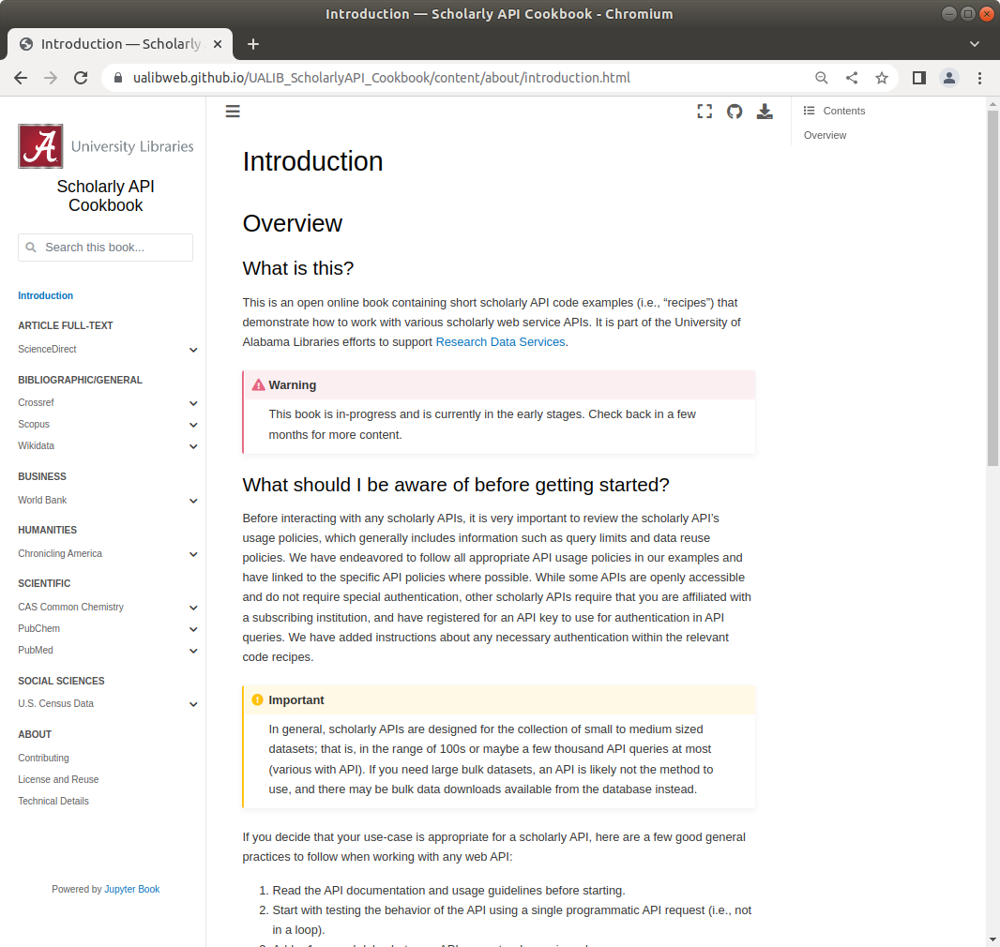

.. sectionauthor:: Vincent F. Scalfani <vfscalfani@ua.edu>

University of Alabama Libraries Scholarly API Services
**********************************************************

| **Vincent F. Scalfani**
| *Chemistry and Informatics Librarian*
| vfscalfani@ua.edu
| `www.lib.ua.edu`_

.. _www.lib.ua.edu: https://www.lib.ua.edu/#/home

TL;DR
========

Check out our `UA Libraries Scholarly API Cookbook`_, which is an online Jupyter Book
containing tutorial code for interacting with numerous scholarly APIs. The Cookbook currently 
includes examples with ten different Scholarly APIs and four different programming languages: ``Python``, ``Bash Shell``, ``Mathematica``, and ``Matlab``. Using scholarly APIs can help you:

* Automate literature searches
* Compile custom datasets
* Create reproducible workflows

If any of this looks interesting to you, let us know and we will help you get started!

.. _UA Libraries Scholarly API Cookbook: https://ualibweb.github.io/UALIB_ScholarlyAPI_Cookbook/content/about/introduction.html

   
   Screenshot of UA Libraries Scholarly API Cookbook Homepage

What is a Scholarly API?
===========================

Scholarly Application Programming Interfaces (APIs) are most often web-based 
services that allow programmatic access to a database. In contrast to traditional
information database access and user interaction via a website, scholarly APIs 
are typically accessed using a scripting programming language and return data 
in machine-readable format such as CSV, JSON, or XML data. 

What kind of Scholarly APIs are available?
============================================

There are scholarly APIs available for openly accessible and library subscription databases. 
Some examples include PubMed, Scopus, Web of Science, Crossref metadata, HathiTrust, Worldbank, and IEEE.

.. note::

   See our `Scholarly API Research Guide`_ for more examples.

.. _Scholarly API Research Guide: https://guides.lib.ua.edu/c.php?g=1201640&p=8787138

How does it work? 
===================

Here is basic example of how to interact with a scholarly API from our `UA Libraries Scholarly API Cookbook`_. This example uses Python to request data from the `Library of Congress Chronicling America API`_:

.. _Library of Congress Chronicling America API: https://chroniclingamerica.loc.gov/about/api/

.. testcode::
   
   # import python libraries
   from time import sleep
   import requests
   from pprint import pprint

.. testcode::

   # define the api
   api = "https://chroniclingamerica.loc.gov/" 
   # define query and request json data
   request = requests.get(api+"lccn/sn84023600.json").json()
   # print results
   pprint(request)

.. testoutput::

   {'end_year': '18??',
    'issues': [],
    'lccn': 'sn84023600',
    'name': 'Alabama State intelligencer. [volume]',
    'place': ['Alabama--Tuscaloosa--Tuscaloosa'],
    'place_of_publication': 'Tuskaloosa [sic], Ala.',
    'publisher': 'T.M. Bradford',
    'start_year': '183?',
    'subject': [],
    'url': 'https://chroniclingamerica.loc.gov/lccn/sn84023600.json'}

Why use a Scholarly API?
================================

Using scholarly APIs can help you:

1. Automate numerous or frequently run literature searches
2. Create and document  highly reproducible searches such as those for systematic reviews
3. Compile a custom dataset such as bibliographic data, material property data, or government data
4. Prepare datasets in different machine-readable formats and easily filter data
5. Incorporate your literature or data searches directly into your data analysis or visualization workflows
6. ...and much more!

How can UA Libraries help?
===========================

Our `UA Libraries Scholarly API Cookbook`_ contains numerous code examples and use-cases for working with scholarly APIs. The Cookbook is licensed with a permissive MIT open-source license. As such, you are welcome to adapt any of the code as needed. Moreover, if you have a specific use-case in mind or need help getting started, we can work with you to develop a specific programming script for your research or teaching.

About this Flyer
====================

This flyer was written in `reStructuredText`_ markup language. The document was then built (i.e. code tested and html/pdf created) using the `Sphinx Python Documentation Generator`_. You can download the source file and build parameters for this flyer on `GitHub`_.

.. _reStructuredText: https://docutils.sourceforge.io/rst.html
.. _Sphinx Python Documentation Generator: https://www.sphinx-doc.org/en/master/
.. _GitHub: https://github.com/vfscalfani/rst_layouts
